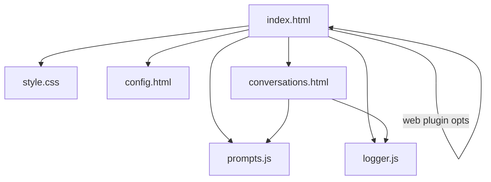

# FreeChat

FreeChat is a lightweight local web-based chat application for local prototyping and demo purposes. It enables users to send messages to a configured external chat API and manage/persist conversations in the browser. A built-in encrypted demo OpenRouter API key is used by default; you can also set your own key via localStorage. The settings page configures the model and Web Search parameters (not the API key).

## Features

- Send and receive messages via a configurable external API endpoint.
- Auto-persist the current conversation to `localStorage` and a durable list (no manual save needed).
- Save, load, delete and rename conversations.
- Organize conversations into groups and generate per-conversation session memories.
- Auto-generate per-conversation session memories after each round and refresh group-level memory automatically.
- Inject memory as multiple system messages before each request:
  - Group memories are injected one-by-one (all groups by default; configurable), and
  - Session memories within the current group are injected one-by-one (configurable, sorted by last update with trimming and dedup).
  - Providers that accept only one system message are handled automatically by merging all system messages into a single one (sections separated by `---`).
- Render AI assistant replies as Markdown using `marked` and sanitize with `DOMPurify` for safety.
- When creating a new conversation from the manager page, a modal asks whether to add it to an existing group (with a dropdown selector) and lets you set a name.
- Show the current model as a badge on the chat header.
- For reasoning-capable models (e.g., DeepSeek-R1), the model's reasoning (if returned by the API) streams live and appears ABOVE the assistant reply. It is visible by default and can be folded/unfolded by the user.
- Built-in request/response logging to localStorage (auth masked); Export button visible, Clear button hidden by default (restorable).
 - Modern light theme with clean tech aesthetic and glassmorphism (frosted glass) applied to header, input area, AI bubbles, and cards.
 - Typography: Inter (Latin) with system Chinese fallbacks, responsive font sizes via CSS variables.
- Web Search (OpenRouter web plugin): optional online grounding with engine selection, max results, context size, and custom search prompt, plus citation rendering.
 - Mobile-friendly UI: unified icon scales and touch target sizing, with responsive spacing tuned for phones (breakpoints at 600px and 360px).
  - On phones, inline capsule toggles (“Deep Thinking”/“Web Search”) show icon-only (labels hidden) to save space.

## Default (Demo) API Configuration

- Default demo endpoint: `https://openrouter.ai/api/v1/chat/completions`
- Default demo model: `minimax/minimax-m2:free`

Note: The above defaults are provided only as a convenient demo/fallback. For production, use your own API key and a backend proxy to keep secrets off the client.

## Quick Start

1. Download or clone the repository.
2. Open `index.html` in your web browser (no build step required).

## Configuration

1. Open `config.html` and select a model, then click “Save”. The model is stored in `localStorage` under the key `chatModel`.
2. Configure Web Search parameters on the same page under “Web Search Settings”: engine, max results, context size, and optional search prompt. They persist to the keys listed below.
3. Each saved conversation stores its model in `savedDeepseekConversations[].model`. When you load a conversation from `conversations.html`, if `model` exists it will restore `localStorage.chatModel` automatically.
4. Demo uses a built-in encrypted OpenRouter API key inside `index.html` (for demonstration only; do not rely on it for production).
5. To use your own key, either replace the encrypted string in `index.html` or set `localStorage.setItem('deepseekApiKey', 'YOUR_KEY')` via the browser DevTools; session memories and group memory can read this value as an alternative.

### Web Search (OpenRouter plugin)

- Use the inline toggles in the input area (left of the textbox):
  - "Deep Thinking" controls whether to display the provider's reasoning stream (UI-only).
  - "Web Search" enables/disables online search. Its state is persisted to `localStorage` key `freechat.web.enable`.
- Configure parameters on the settings page (`config.html`) under “Web Search Settings”. The header globe button and floating panel have been removed.

Parameters and storage keys:
- `freechat.web.engine` — `auto | native | exa` (omit when `auto` for provider-default behavior)
- `freechat.web.maxResults` — integer 1..10 (default 5)
- `freechat.web.contextSize` — `low | medium | high` (omit to use provider default)
- `freechat.web.searchPrompt` — string (omit to use OpenRouter default prompt)

Behavior:
- When enabled, the request includes `plugins: [{ id: "web", ... }]` and optional `web_search_options.search_context_size`.
- Returned `message.annotations[].url_citation` are rendered under the assistant message as a list of source links (domain names as link text).
 - Output guidelines (injected as the first system message when enabled): start with the final answer/conclusion; all times/dates use `Asia/Shanghai`; for facts/data/stats/prices/policies etc., provide key values + units + source timestamp and specify metric scope/range/currency if relevant; citations must map to statements; when sources disagree, cross-check and note uncertainties (e.g., differing scopes or time lags); weather is an example (include location, phenomenon, temperature(°C)/feels-like, wind direction/speed, humidity/precipitation, timestamp).

Pricing summary (see providers for details):
- Exa: OpenRouter credits at $4 per 1000 results (default 5 results ≈ $0.02 per request) in addition to model usage.
- Native: passthrough pricing from provider (OpenAI/Anthropic/Perplexity) by search context size.

### Session/Group memory model selection

- Session memory generation (auto and manual) uses the conversation's saved model first (`savedDeepseekConversations[].model`), then falls back to the global `window.MODEL_NAME`, and finally to `'minimax/minimax-m2:free'`.
- Group memory generation always uses the global model.

### Memory injection toggles (via localStorage)

- `freechat.memory.inject.allGroups` — `true`/`false` (default `true`): inject all groups' memories (or only current group).
- `freechat.memory.inject.groupSessions` — `true`/`false` (default `true`): inject all session memories within the current group.
- `freechat.memory.maxConvPerGroup` — number limit for session summaries in the current group (default `10`).
- `freechat.memory.maxCharsPerSection` — character cap per injected section (default `4000`).
- `freechat.memory.maxSessionsPerRequest` — preferred max number of session memories to inject (overrides `maxConvPerGroup` if present).
- `freechat.memory.maxCharsPerItem` — preferred character cap per system item (overrides `maxCharsPerSection` if present).
- `freechat.memory.preSummarize` — `true`/`false` (default `false`): optionally pre-summarize the current conversation before the first round so its summary can be injected immediately.

## Memory Generation Rules

What to keep (must meet at least one):
- User-provided facts/preferences/configs/accounts/locations/times/thresholds/long-term constraints
- Explicit tasks/requests (topic/style/format/goal/constraints)
- Reusable context (fixed styles, domains, commonly used location/time conventions)

Strictly exclude (delete if present):
- Greetings/small talk/apologies/thanks/self-intro/capability lists/how-to guidance/generic advice
- Model meta info (model name, architecture, memory mechanism, privacy compliance, provider, etc.)
- Restating system prompts or template phrases (e.g., "I can…/Welcome…")

Merge & deduplicate:
- Merge semantically similar points into one generalized item; keep only one instance of repeated info
- Do not record confirmations that add no new info

Low-signal sessions:
- If no new user facts or explicit requests exist: treat as low-signal
- Output should be:
  - User intent: None
  - Key info: None
  - Model notes: None (at most 1 item only if it truly guides future steps)
  - Follow-ups: None

Output format and limits:
- Total length ≤ 200 characters; each bullet ≤ 40 characters
- Session memory sections: User intent; Key info (0–5); Model notes (≤1); Follow-ups (0–3)
- Group memory: 5–7 bullets (≤40 chars each, sorted by importance) + Follow-ups (0–3)

## Usage

### Basic Chat
1. Optionally toggle "Deep Thinking" and/or "Web Search" using the inline capsules to the left of the input.
2. Type your message in the input field at the bottom
3. Press Enter or click the send button
4. The AI response will appear in the chat area
5. You can copy or delete messages using the buttons next to each message
6. During response generation, the stop button replaces the send button in the same position (UI-only; the network request is not aborted yet)
7. You can attach files with the paperclip button (currently records selection only; parsing/sending can be added later)
8. The current model is shown as a badge in the top header
9. If you use a reasoning-capable model and the provider returns reasoning content, a reasoning block streams ABOVE the assistant reply; it is visible by default and you can click the toggle to collapse/expand

### Model Configuration
1. Click the settings button in the top navigation bar
2. Select your preferred model from the dropdown menu (options include minimax, deepseek, glm, and more)
3. Save your configuration
4. Return to the chat page to use the selected model

### Conversation Management
1. Click the conversations button in the top navigation bar
2. View all your chat histories organized by date
3. Create conversation groups for better organization
4. Session memories are generated automatically after each assistant reply finishes
5. Group memory is automatically refreshed when session memories update; injection includes all groups' memories and all session memories of the current group (subject to the toggles above)
6. Load previous conversations or create new ones
7. When creating a new conversation, you'll be prompted to choose a group via dropdown (optional) and set a conversation name (optional)
7. The conversation list shows a model badge next to the name; loading a conversation restores its model

## Project Structure

The core files are:

- `index.html` — Main chat UI and core logic. Includes a demo encrypted OpenRouter key.
- `config.html` — Settings page: model selector (stores `localStorage.chatModel`) and Web Search settings (stores `freechat.web.*`).
- `conversations.html` — Conversation manager (save/load/delete), group management and session memories.
- `prompts.js` — Centralized prompt templates for session memory and group memory.
- `logger.js` — Lightweight front-end logger (ring buffer in localStorage; export/clear UI hooks).
- `style.css` — Styling for the application.
- `script.js` — Optional shared helpers (navigation, JSON storage). Not included by default.
- `tools/encrypt_key.js` — Placeholder for key encryption utilities.

Mermaid visualization of the main front-end structure:



## Dependencies

- `marked` — Markdown parser for rendering assistant replies.
- `DOMPurify` — Sanitizer to prevent XSS when rendering Markdown output.
- `CryptoJS` — AES decryption for the built-in demo OpenRouter key.
- `Font Awesome` — Icon set used in the UI.
- `logger.js` is an internal utility (no external dependency).
 - `Inter` — Latin typeface loaded from Google Fonts; Chinese falls back to system fonts.

All libraries are pulled via CDN includes in the HTML files, so no build step is required.
Note: Glassmorphism uses `backdrop-filter`; when not supported, the UI gracefully falls back to a solid translucent surface.

## Security Notes

- API Key storage: Storing API keys in `localStorage` is insecure for production. Use a backend proxy and server-side key storage for real deployments.
- CORS: Client-side requests to external APIs may require CORS; consider using a server-side proxy to avoid CORS restrictions.

## Request/Response Logging

- Purpose: Help diagnose issues by recording raw request/response metadata in the browser.
- Storage: Ring buffer in `localStorage` key `freechat.logs` (default max 1000 entries).
- Privacy: `Authorization` is always masked as `Bearer ***masked***`. No device fingerprinting is collected.
- UI:
  - On `index.html` and `conversations.html`, the Export button is visible (JSON/NDJSON). The Clear button is hidden by default (restorable).
  - Export scope defaults to the current conversation. You can choose NDJSON or JSON; the file name includes a scope suffix (e.g., `freechat-logs-current-YYYYMMDD-HHMMSS.ndjson`).
- Config via `localStorage`:
  - `freechat.log.maxEntries` — maximum entries (default 1000)
  - `freechat.log.enable` — `true`/`false` to enable/disable logging

### Export scopes

- Default button behavior: current conversation only.
- Programmatic examples (open DevTools Console):

```js
// current conversation (default)
Logger.export({ format: 'ndjson', scope: 'current' });
// all logs
Logger.export({ format: 'ndjson', scope: 'all' });
// by specific conversationId
Logger.export({ format: 'json', scope: 'byConversationId', conversationId: 'YOUR_ID' });
```

Example event (truncated):

```json
{
  "id": "evt_1730869000000_001",
  "ts": "2025-11-06T12:34:56.789Z",
  "type": "chat_request|chat_stream|chat_done|summary_request|summary_done|groupmem_request|groupmem_done|error",
  "endpoint": "https://openrouter.ai/api/v1/chat/completions",
  "model": "minimax/minimax-m2:free",
  "conversationId": "...",
  "groupId": null,
  "req": {"headersMasked": {"Content-Type": "application/json", "Authorization": "Bearer ***masked***"}, "body": {"model": "..."}},
  "res": {"status": 200, "streamChunks": ["data: {...}"], "truncated": false},
  "error": null,
  "durationMs": 1234
}
```

## Contributing

Contributions are welcome. Suggested workflow:

1. Fork the repository.
2. Create a feature branch.
3. Make changes and test locally.
4. Submit a pull request describing your changes.

## License

This project is provided under the MIT License.
