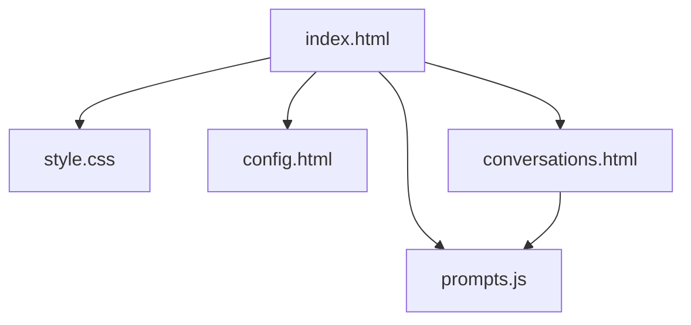

# FreeChat

FreeChat is a lightweight local web-based chat application for local prototyping and demo purposes. It enables users to send messages to a configured external chat API, manage and persist conversations in the browser, and configure an API key via a settings page.

## Features

- Send and receive messages via a configurable external API endpoint.
- Auto-persist the current conversation to `localStorage` and a durable list (no manual save needed).
- Save, load, delete and rename conversations.
- Organize conversations into groups and generate per-conversation summaries.
- Auto-generate per-conversation summaries after each round and refresh group-level memory automatically.
- Inject memory as a single system message before each request: group memory (always) + session summary (only within the same group).
- Render AI assistant replies as Markdown using `marked` and sanitize with `DOMPurify` for safety.

## Default (Demo) API Configuration

- Default demo endpoint: `https://openrouter.ai/api/v1/chat/completions`
- Default demo model: `minimax/minimax-m2:free`

Note: The above defaults are provided only as a convenient demo/fallback. For production, use your own API key and a backend proxy to keep secrets off the client.

## Quick Start

1. Download or clone the repository.
2. Open `index.html` in your web browser (no build step required).

## Configuration

1. Open `config.html` and select a model, then click “Save”. The model is stored in `localStorage` under the key `chatModel`.
2. Each saved conversation stores its model in `savedDeepseekConversations[].model`. When you load a conversation from `conversations.html`, if `model` exists it will restore `localStorage.chatModel` automatically.
3. Demo uses a built-in encrypted OpenRouter API key inside `index.html` (for demonstration only; do not rely on it for production).
4. To use your own key, either replace the encrypted string in `index.html` or set `localStorage.setItem('deepseekApiKey', 'YOUR_KEY')` via the browser DevTools; conversation summaries and group memory can read this value as an alternative.

## Usage

### Basic Chat
1. Type your message in the input field at the bottom
2. Press Enter or click the send button
3. The AI response will appear in the chat area
4. You can copy or delete messages using the buttons next to each message
5. During response generation, a stop button appears that allows you to terminate the response early

### Model Configuration
1. Click the settings button in the top navigation bar
2. Select your preferred model from the dropdown menu (options include minimax, deepseek, glm, and more)
3. Save your configuration
4. Return to the chat page to use the selected model

### Conversation Management
1. Click the conversations button in the top navigation bar
2. View all your chat histories organized by date
3. Create conversation groups for better organization
4. Summaries are now generated automatically after each assistant reply finishes
5. Group memory is automatically refreshed when conversation summaries update
6. Load previous conversations or create new ones
7. The conversation list shows a model badge next to the name; loading a conversation restores its model

## Project Structure

The core files are:

- `index.html` — Main chat UI and core logic. Includes a demo encrypted OpenRouter key.
- `config.html` — Model selector (stores to `localStorage` key `chatModel`).
- `conversations.html` — Conversation manager (save/load/delete), group management and summaries.
- `prompts.js` — Centralized prompt templates for session summary and group memory.
- `style.css` — Styling for the application.
- `script.js` — Optional shared helpers (navigation, JSON storage). Not included by default.
- `tools/encrypt_key.js` — Placeholder for key encryption utilities.

Mermaid visualization of the main front-end structure:

## Dependencies

- `marked` — Markdown parser for rendering assistant replies.
- `DOMPurify` — Sanitizer to prevent XSS when rendering Markdown output.
- `CryptoJS` — AES decryption for the built-in demo OpenRouter key.
- `Font Awesome` — Icon set used in the UI.

All libraries are pulled via CDN includes in the HTML files, so no build step is required.

## Security Notes

- API Key storage: Storing API keys in `localStorage` is insecure for production. Use a backend proxy and server-side key storage for real deployments.
- CORS: Client-side requests to external APIs may require CORS; consider using a server-side proxy to avoid CORS restrictions.

## Contributing

Contributions are welcome. Suggested workflow:

1. Fork the repository.
2. Create a feature branch.
3. Make changes and test locally.
4. Submit a pull request describing your changes.

## License

This project is provided under the MIT License.
