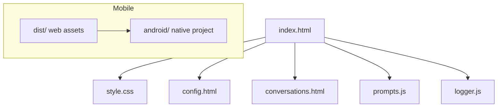

# FreeChat

FreeChat is a lightweight local web-based chat application intended for quick prototyping and demos. It runs entirely in the browser (static HTML/CSS/JS) and supports configurable external chat API endpoints, local conversation persistence, session/group memories, and optional Android packaging via Capacitor.

Key notes:
- Demo-only built-in encrypted OpenRouter API key is included for convenience; do not use it in production. For main chat replace the encrypted key in `index.html` or use a backend proxy.
- Default demo endpoint: `https://openrouter.ai/api/v1/chat/completions`
- Default demo model: `minimax/minimax-m2:free`

Features
- Send/receive messages via a configurable external API endpoint.
- Auto-persist conversations to localStorage (`savedDeepseekConversations`) — first send auto-creates an entry; subsequent updates use throttled writes.
- Conversation grouping, create/rename/move/delete groups.
- Session (conversation) and group memories: auto-generate summaries and inject them as system messages before requests.
- Web Search plugin support (OpenRouter web plugin) — configurable engine/max results/context size/search prompt; returns citations rendered under assistant messages.
- Flow streaming support, reasoning (if provider returns it) rendered above assistant reply and foldable.
- Local request/response logging with masked Authorization in `localStorage.freechat.logs`.
- Android packaging via Capacitor using `dist/` static assets.

Quick start
1. Clone or download the repository.
2. Open `index.html` in a modern browser — no build required for development.
3. To build `dist/` for Capacitor: `npm install` then `npm run build` (copies static assets to `dist/`).
4. For Android: `npx cap copy` → open `android/` in Android Studio → run or build.

Configuration
- Settings page (`config.html`) stores:
  - `localStorage.chatModel` — selected model name.
  - `freechat.systemPrompt` — optional global system prompt injected when present.
  - `freechat.modelParams` — JSON object of model params (temperature/top_p/max_tokens/stream).
  - `freechat.web.*` — web search settings (`engine`, `maxResults`, `contextSize`, `searchPrompt`).
- Per-conversation: each saved conversation keeps its `model` and `modelParams` so replaying a conversation uses the original parameters if present.
- Runtime model resolution uses `getCurrentModel()` (conversation-level `model` → `localStorage.chatModel` → built-in default).

Memory & injection
- Summaries are generated asynchronously: summary jobs are enqueued into `memoryJobs` (localStorage) and processed by a Blob Worker. The UI shows per-session memory status badges.
- Injection order: (1) Web synthesis prompt (if web search enabled), (2) group memories (each as system), (3) session memories in current group (each as system), (4) conversation history.
- For providers accepting only one system message, multiple system items are merged with `---` separators.
- Memory generation templates and rules live in `prompts.js` and enforce noise reduction, maximum lengths, and content restrictions.

Web Search (OpenRouter web plugin)
- Enable with the inline Web Search toggle near the input; parameters are configured in `config.html`.
- When enabled the request body includes `plugins: [{ id: "web", ... }]`. Returned `message.annotations[].url_citation` are rendered as a collapsible "References (N)" list below assistant messages.
- Output guidance is injected (`PROMPTS.WEB_SYNTHESIS`) to request final answer first and structured references with timestamps and units where applicable.

LocalStorage keys (important)
- `deepseekConversation`, `savedDeepseekConversations`, `conversationGroups`, `memoryJobs`, `deepseekApiKey` (optional fallback for memory calls), `freechat.logs`, `freechat.web.*`, `freechat.memory.*`, `freechat.systemPrompt`, `freechat.modelParams`.

Logging
- `logger.js` stores masked events in `freechat.logs` (ring buffer). Export examples (in the browser console):
```js
// current conversation
Logger.export({ format: 'ndjson', scope: 'current' });
// all logs
Logger.export({ format: 'ndjson', scope: 'all' });
```

Android (Capacitor)
- Build web assets: `npm run build` (copies to `dist/`).
- Sync to native: `npx cap copy`.
- Open Android Studio: open `android/` and run on device/emulator or build signed APK.
- Windows one-click: `scripts/build-apk.ps1` / `scripts/build-apk.cmd` (requires JDK17 and Android SDK components).

Security & production notes
- Do not store production API keys in client-side storage. Use a backend proxy to manage secrets.
- Client-side calls may be blocked by CORS; prefer a server-side proxy for production or use a provider with permissive CORS for client access.

Project structure (high level)


Dependencies
- All runtime libraries are pulled via CDN in the HTML files: `marked`, `DOMPurify`, `CryptoJS`, `Font Awesome`, plus Google Fonts for `Inter`.

License
- MIT

Acknowledgements
- See `prompts.js` / `index.html` for implementation details and configuration keys.

