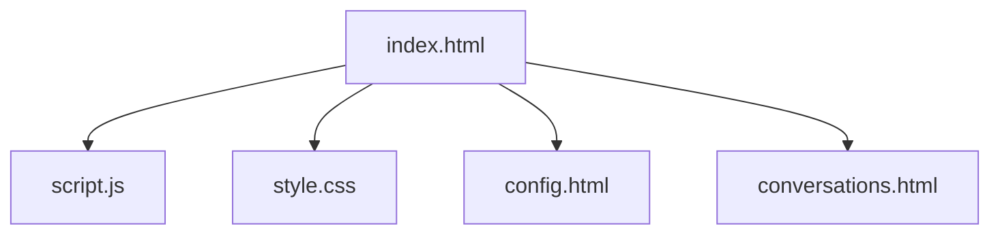

# FreeChat

FreeChat is a lightweight local web-based chat application for local prototyping and demo purposes. It enables users to send messages to a configured external chat API, manage and persist conversations in the browser, and configure an API key via a settings page.

## Features

- Send and receive messages via a configurable external API endpoint.
- Persist current conversation to `localStorage`.
- Save, load, delete and rename conversations.
- Organize conversations into groups and generate per-conversation summaries.
- Aggregate group-level memory summaries and inject them as system prompts when chatting within the same group.
- Render AI assistant replies as Markdown using `marked` and sanitize with `DOMPurify` for safety.

## Default (Demo) API Configuration

- Default demo endpoint: `https://api.openrouter.ai/v1/chat/completions`
- Default demo model: `minimax/minimax-m2:free`

Note: The above defaults are provided only as a convenient demo/fallback. For production, use your own API key and a backend proxy to keep secrets off the client.

## Quick Start

1. Download or clone the repository.
2. Open `index.html` in your web browser (no build step required).

## Configuration

1. Open `config.html` and paste your API Key, then click “Save” (the UI label may be localized).
2. The key is stored in the browser's `localStorage` under `deepseekApiKey` for demo purposes.

## Usage

- Type your message in the input box and press the send button (or press Enter) to send.
- Use the Conversations button to open `conversations.html` to save or load conversations.
- Saved conversations are stored in `localStorage` under `savedDeepseekConversations`.

## Project Structure

The core files are:

- `index.html` — Main chat UI and core logic.
- `config.html` — Settings page to store the API Key.
- `conversations.html` — Conversation manager (save/load/delete), group management and summaries.
- `style.css` — Styling for the application.
- `script.js` — Small script for navigation and local storage helpers.

Mermaid visualization of the main front-end structure:

## Dependencies

- `marked` — Markdown parser for rendering assistant replies.
- `DOMPurify` — Sanitizer to prevent XSS when rendering Markdown output.

If those libraries are used via CDN includes in `index.html`, no build step is required.

## Security Notes

- API Key storage: Storing API keys in `localStorage` is insecure for production. Use a backend proxy and server-side key storage for real deployments.
- CORS: Client-side requests to external APIs may require CORS; consider using a server-side proxy to avoid CORS restrictions.

## Contributing

Contributions are welcome. Suggested workflow:

1. Fork the repository.
2. Create a feature branch.
3. Make changes and test locally.
4. Submit a pull request describing your changes.

## License

This project is provided under the MIT License.
