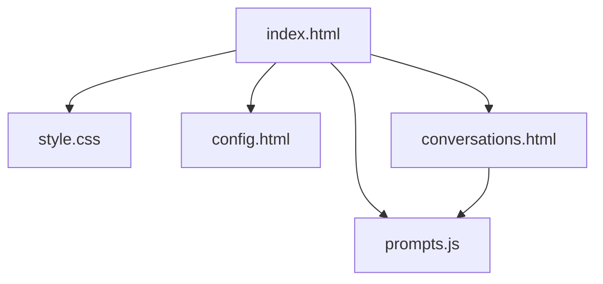

# FreeChat

FreeChat 是一个轻量级的本地 Web 聊天应用，适用于本地演示和快速原型开发。用户可以通过配置的外部聊天 API 发送消息、本地管理会话，并通过设置页配置 API Key。

## 功能

- 通过可配置的外部 API 接口发送和接收消息。
- 自动无感持久化：首条消息即创建持久会话条目，后续以节流方式持续写回（无需手动保存）。
- 保存、加载、删除与重命名会话。
- 将会话按分组管理，自动生成会话摘要，并自动刷新分组记忆。
- 在每次请求前以一条 system 消息注入记忆：分组记忆（对所有消息有效）+ 会话摘要（仅在同一分组内生效）。
- 将 AI 回复以 Markdown 渲染（使用 `marked`）并用 `DOMPurify` 进行消毒以防 XSS。

## 默认（演示）API 配置

- 默认演示端点：`https://openrouter.ai/api/v1/chat/completions`
- 默认演示模型：`minimax/minimax-m2:free`

说明：以上默认设置仅用于演示/回退。生产环境请使用后端代理并在服务器端安全管理 API Key。

## 快速开始

1. 下载或克隆仓库。
2. 在浏览器中打开 `index.html`（无需构建步骤）。

## 配置

1. 打开 `config.html`，从下拉菜单选择模型并点击“保存”，模型会以 `chatModel` 键写入 `localStorage`。
2. 演示默认使用内置的加密 OpenRouter Key（仅用于演示，不可用于生产）。
3. 如需使用你自己的 Key，可在浏览器控制台执行 `localStorage.setItem('deepseekApiKey', 'YOUR_KEY')`，或替换 `index.html` 中的加密串；会话摘要与分组记忆也会读取该值作为替代。

## 使用说明

### 基础聊天
1. 在底部输入框中输入您的消息
2. 按回车键或点击发送按钮
3. AI回复将显示在聊天区域
4. 您可以使用每条消息旁边的按钮复制或删除消息
5. 在响应生成过程中，会出现一个停止按钮，允许您提前终止响应

### 模型配置
1. 点击顶部导航栏中的设置按钮
2. 从下拉菜单中选择您偏好的模型（选项包括minimax、deepseek、glm等）
3. 保存您的配置
4. 返回聊天页面使用所选模型

### 会话管理
1. 点击顶部导航栏中的会话按钮
2. 查看按日期组织的所有聊天记录
3. 创建会话分组以便更好地组织
4. 会话摘要会在每轮 AI 回复结束后自动生成
5. 分组记忆会在摘要更新后自动刷新
6. 加载之前的会话或创建新会话

## 文件说明

- `index.html` — 主聊天页面与核心逻辑；包含演示用加密 OpenRouter Key。
- `config.html` — 模型选择器（保存到 `localStorage` 键 `chatModel`）。
- `conversations.html` — 会话管理页面（保存/加载/删除、分组管理、摘要查看/重新生成）。
- `prompts.js` — 提示词模板，集中管理会话摘要与分组记忆提示词。
- `style.css` — 应用样式。
- `script.js` — 可选的共用脚本（导航、JSON 存储助手），当前默认未引入。
- `tools/encrypt_key.js` — API 密钥加密工具占位文件。

Mermaid 项目结构图：

## 依赖

- `marked` — Markdown 解析器，用于渲染 AI 回复中的 Markdown 内容。
- `DOMPurify` — 对渲染的 HTML 进行消毒以防 XSS。
- `CryptoJS` — 用于对演示 OpenRouter Key 进行 AES 解密。
- `Font Awesome` — 界面使用的图标库。

所有库均通过 HTML 文件中的 CDN 引入，无需构建步骤。

## 安全提示

- API Key 存储：在 `localStorage` 中保存 Key 仅适用于演示，生产环境请使用后端代理与服务器端安全存储。
- CORS：客户端直接调用外部 API 可能受 CORS 限制，建议使用后端代理避免跨域问题。

## 贡献

欢迎贡献。建议流程：

1. Fork 仓库。
2. 创建功能分支。
3. 本地修改并测试。
4. 提交 Pull Request 并描述你的变更。

## 许可证

本项目采用 MIT 许可证。
