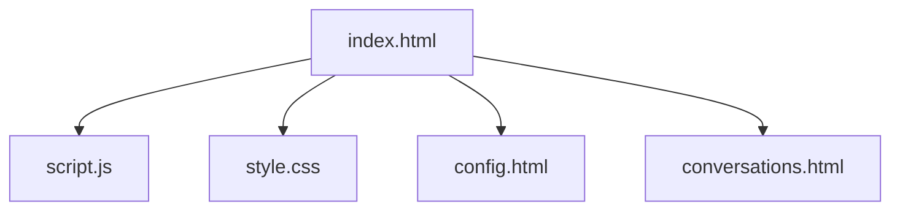

# FreeChat

FreeChat 是一个轻量级的本地 Web 聊天应用，适用于本地演示和快速原型开发。用户可以通过配置的外部聊天 API 发送消息、本地管理会话，并通过设置页配置 API Key。

## 功能

- 通过可配置的外部 API 接口发送和接收消息。
- 将当前会话持久化到 `localStorage`。
- 保存、加载、删除与重命名会话。
- 将会话按分组管理，并能生成会话摘要与分组记忆。
- 将 AI 回复以 Markdown 渲染（使用 `marked`）并用 `DOMPurify` 进行消毒以防 XSS。

## 默认（演示）API 配置

- 默认演示端点：`https://openrouter.ai/api/v1/chat/completions`
- 默认演示模型：`minimax/minimax-m2:free`

说明：以上默认设置仅用于演示/回退。生产环境请使用后端代理并在服务器端安全管理 API Key。

## 快速开始

1. 下载或克隆仓库。
2. 在浏览器中打开 `index.html`（无需构建步骤）。

## 配置

1. 打开 `config.html` 并粘贴你的 API Key，然后点击“保存”。
2. 演示模式下 Key 会保存在浏览器的 `localStorage`（键名 `deepseekApiKey`）。

## 使用说明

### 基础聊天
1. 在底部输入框中输入您的消息
2. 按回车键或点击发送按钮
3. AI回复将显示在聊天区域
4. 您可以使用每条消息旁边的按钮复制或删除消息
5. 在响应生成过程中，会出现一个停止按钮，允许您提前终止响应

### 模型配置
1. 点击顶部导航栏中的设置按钮
2. 从下拉菜单中选择您偏好的模型（选项包括minimax、deepseek、glm等）
3. 保存您的配置
4. 返回聊天页面使用所选模型

### 会话管理
1. 点击顶部导航栏中的会话按钮
2. 查看按日期组织的所有聊天记录
3. 创建会话分组以便更好地组织
4. 为会话生成自动摘要
5. 加载之前的会话或创建新会话

## 文件说明

- `index.html` — 主聊天页面与核心逻辑。
- `config.html` — 设置页面，用于保存 API Key（演示用途）。
- `conversations.html` — 会话管理页面（保存/加载/删除、分组管理、摘要查看）。
- `style.css` — 应用样式。
- `script.js` — 页面间的小型共用脚本（导航、存储助手等）。

Mermaid 项目结构图：

## 依赖

- `marked` — Markdown 解析器，用于渲染 AI 回复中的 Markdown 内容。
- `DOMPurify` — 对渲染的 HTML 进行消毒以防 XSS。

如果这些库通过 CDN 在 `index.html` 中引入，则无需构建步骤。

## 安全提示

- API Key 存储：在 `localStorage` 中保存 Key 仅适用于演示，生产环境请使用后端代理与服务器端安全存储。
- CORS：客户端直接调用外部 API 可能受 CORS 限制，建议使用后端代理避免跨域问题。

## 贡献

欢迎贡献。建议流程：

1. Fork 仓库。
2. 创建功能分支。
3. 本地修改并测试。
4. 提交 Pull Request 并描述你的变更。

## 许可证

本项目采用 MIT 许可证。
