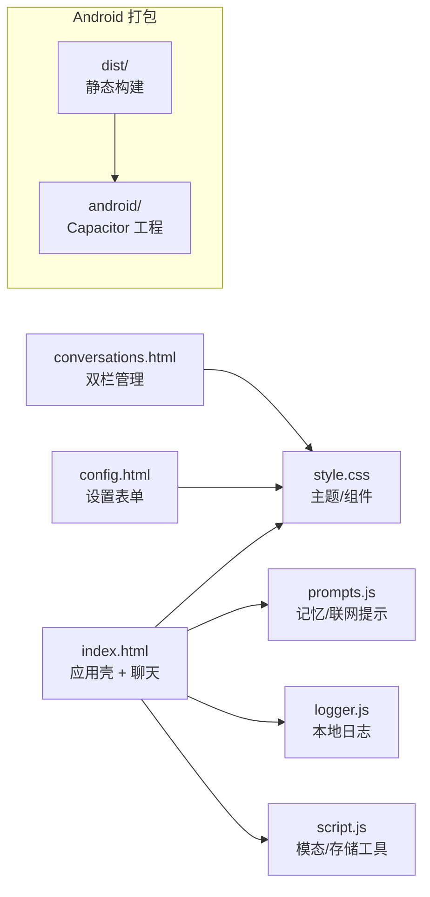

# FreeChat

## 项目功能概述
FreeChat 是一个“纯前端 + 本地存储”的隐私侧聊天界面。新版 UI 引入统一的 App Shell（桌面双栏 + 移动抽屉）、全局状态条与 toast、会话卡片 + 批量操作、简洁的单页设置中心。所有数据（消息、分组、记忆、日志、配置）均保存在浏览器/Capacitor WebView 的 `localStorage`/IndexedDB 中，同一套静态资源也可直接打包为 Android App。

### 核心亮点
- **端侧私密**：无需账号与云同步；隐私面板实时提示存储占用。
- **🎨 复古打字机界面**：完整的复古办公场景设计，包括金属打字机面板（顶部/底部）、木质抽屉侧边栏、办公桌纹理背景、米黄色便签纸卡片；用户问题与 AI 回复配对显示，具备纸张纹理、3D 阴影、轻微旋转等复古效果；历史消息支持逐字符打字机动画；每张便签支持收藏功能，收藏内容可在侧边栏独立查看；所有页面（主聊天、配置、会话管理）风格统一。
- **📊 精确 Token 计数**：集成 `js-tiktoken` 库实现准确的 token 统计（支持中英文混合场景），并提供改进的估算降级方案。
- **统一体验**：主聊天页拥有 App Bar、抽屉导航、精确 token 进度条、语音/附件入口；会话管理页变成"左分组＋右卡片"并支持多选批量；设置页改为简洁的单页表单并提供实时概览。
- **移动端优化**：顶部收敛为"菜单 + 标题"单行，输入区底部吸附并考虑安全区，工具列横向滑动，抽屉改为全屏浮层，批量操作条顶部吸附，单手操作更友好；便签卡片在移动端自动取消旋转，确保内容不被裁切。
- **记忆管线**：会话/分组记忆异步生成、按"联网提示→分组记忆→会话记忆→历史消息"顺序注入，仍兼容只允许单条 system 的模型。
- **Android 复用**：`npm run build` + `npx cap copy` 即可在 WebView 中获得完全一致的体验。

## 项目结构概述

## 项目使用方式概述
1. **快速上手**
   - 克隆仓库后直接在浏览器打开 `index.html`，无需构建。
   - 可选 `npm install && npm run build` 将资源同步到 `dist/`，再执行 `npx cap copy` 打包到 Android。
2. **聊天工作区**
   - 桌面端保持会话抽屉常驻，移动端通过左上角菜单按钮展开全屏抽屉。
   - **便签纸展示**：消息以复古便签纸风格呈现，每对问答显示在一张米黄色卡片上，具备纸张纹理和 3D 效果；历史消息自动播放打字机动画（可通过 `localStorage.setItem('freechat.ui.typewriterAnimation', 'false')` 禁用），点击便签可立即显示完整内容。
   - 输入区采用金属质感打字机风格，支持语音/附件占位、自动增高、精确 token 进度条（基于 tiktoken），且被固定在页面底部并自动留出安全区；`Enter/Ctrl+Enter` 发送，`Shift+Enter` 换行。
   - 思考/联网/语音/附件四个按钮集中到输入框下方的横排按钮条中，始终全部可见；状态条与 toast 协同显示生成/预警信息。
3. **会话管理（`conversations.html`）**
   - 左侧分组面板提供重命名/删除/重新记忆按钮；右侧以卡片方式分组展示会话。
   - 勾选“启用多选”即可批量移动、删除或导出，并显示实时计数。
   - 从主聊天页的侧边抽屉发起“新建会话”时，会弹出模态：可以从下拉列表直接选择已有分组，也可以输入一个新的分组名称创建分组；当已选择分组时不会再强制要求填写分组名称，“请输入分组名称”的提示只会在“既未选择分组、又未输入新分组名”时出现。
4. **设置中心（`config.html`）**
   - 单页表单：集中配置模型、模型参数、联网搜索参数以及 System 提示与安全说明。
   - 实时概览卡同步展示已保存的模型/参数/联网状态/System 提示；隐私面板汇总本地数据量。
5. **Android 打包**
   - `npm run build` → `npx cap copy` → Android Studio 打开 `android/` 运行或生成 APK/AAB。

## 项目依赖关系概述
- **运行时（CDN 引入）**：`marked`（Markdown 渲染）、`DOMPurify`（消毒）、`CryptoJS`（演示 Key 解密）、`js-tiktoken`（精确 token 计数）、`Font Awesome`、Google Fonts（`Inter`）。
- **工具链**：Node.js/npm（执行 `npm run build`）、Capacitor CLI、JDK17 与 Android SDK（若需打包）。
- 本地/网页直接运行无需打包器或开发服务器，全部是静态资源。

## 实现补充
- **LocalStorage 关键键值**：`deepseekConversation`、`savedDeepseekConversations`、`conversationGroups`、`memoryJobs`、`freechat.logs`、`freechat.web.*`、`freechat.systemPrompt`、`freechat.modelParams` 等。
- **记忆与注入**：Worker 异步拉取摘要任务；若模型只接受单条 system，会自动将多条 system 内容用 `---` 合并。
- **联网搜索**：输入区即可开关；参数在 `config.html` 配置，返回引用以折叠卡显示。
- **日志导出**：在控制台执行 `Logger.export({ scope: 'current' | 'all', format: 'ndjson' })` 下载遮蔽后的请求/响应轨迹。

## 安全提示
- 仓库内 AES 混淆的 OpenRouter Key 仅供本地演示，生产环境请替换或转为后端代理。
- 直接从浏览器访问第三方 API 仍可能被 CORS 拒绝，部署时请准备自有网关或代理。

## 许可证
MIT

