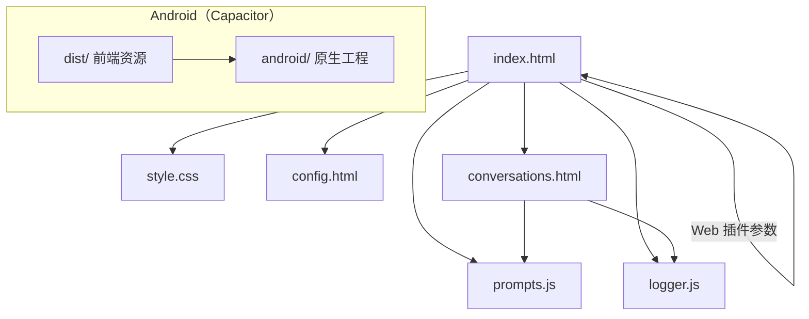

# FreeChat

FreeChat 是一个轻量级的本地 Web 聊天应用，适用于本地演示和快速原型开发。用户可以通过配置的外部聊天 API 发送消息、本地管理会话；默认使用内置加密的演示 OpenRouter Key。若要让主聊天使用自有 Key，请替换 `index.html` 中的加密串。通过 `localStorage` 设置的 `deepseekApiKey` 仅用于会话/分组记忆相关调用的替代来源（主聊天不会读取该键）；设置页负责配置模型与“联网搜索参数”（不配置 API Key）。

## 功能

- 通过可配置的外部 API 接口发送和接收消息。
- 自动无感持久化：首条消息即创建持久会话条目，后续以节流方式持续写回（无需手动保存）。
- 保存、加载、删除与重命名会话。
- 主页面内置“覆盖式抽屉”会话管理（桌面/移动端统一）：抽屉顶部提供“新建会话”主按钮与搜索框，按分组展示会话列表；抽屉内提供“新分组名 + 创建分组”控件（不再需要单独的高级管理页）。
- 空会话显示“欢迎界面”：展示 Logo 与“FreeChat”同一行、以及副标题“在这里可以进行无约束交流。”（整洁布局，不再显示建议卡片）。
- 将会话按分组管理，自动生成会话记忆，并自动刷新分组记忆。
- 在每次请求前以多条 system 消息分别注入记忆：
  - 分组记忆逐条注入（默认全部分组，可配置）；
  - 当前分组的会话记忆逐条注入（可配置，按最近更新时间排序并进行裁剪与去重）。
  - 对仅支持单条 system 的服务商会自动合并为一条（各段用 `---` 分隔）。
- 将 AI 回复以 Markdown 渲染（使用 `marked`）并用 `DOMPurify` 进行消毒以防 XSS。
- 在会话管理页新建会话时，会弹窗询问是否加入已有分组（下拉选择），并可为新会话命名。
- 主聊天页顶部显示当前模型徽标。
- 对于具备“思考”能力的模型（如 DeepSeek-R1），当 API 返回推理内容时，将以流式形式显示在助手正文“上方”，默认展开，用户可点击按钮收起/展开。
- 内置请求/响应日志：记录到 localStorage（遮蔽 Authorization），提供导出按钮；清空按钮默认隐藏（可恢复）。
 - 现代浅色主题 + 简洁科技风，头部/输入区/AI 气泡/卡片采用磨砂玻璃质感（Glassmorphism）。
 - 字体：Inter 用于英数，中文回退系统字体；通过 CSS 变量实现响应式字号。
- 主页面会话标题栏：主聊天页面顶部现新增一个小型会话标题区域，显示当前会话名称与所属分组。
 - 联网搜索（OpenRouter Web 插件）：可选开启在线检索增强，支持引擎选择、结果数、上下文强度与自定义搜索提示，并在回复下方渲染引用链接。
- 移动端友好：统一图标比例与触控尺寸，在 600px/360px 断点对头部、胶囊开关、消息右内边距与消息操作按钮进行优化，避免遮挡并提升可点性。
 - 在 `@media (max-width: 600px)` 断点下，我们已减小消息气泡的左右内边距并微调字体与行高，以增加每行可显示字符数，同时保持触控目标 `--tap` 不变以保证可点性。
 - 手机上，输入区左侧的胶囊开关（“深度思考/联网搜索”）仅显示图标，隐藏文字标签以节省空间。
 - 手机上，输入区采用“三列网格”：左列为两个胶囊开关上下排列，中列为输入框跨两行，右列为“附件（上）/发送或停止（下）”上下排列（仅 CSS，DOM 不变）。

## 默认（演示）API 配置

- 默认演示端点：`https://openrouter.ai/api/v1/chat/completions`
- 默认演示模型：`minimax/minimax-m2:free`

说明：以上默认设置仅用于演示/回退。生产环境请使用后端代理并在服务器端安全管理 API Key。

## 快速开始

1. 下载或克隆仓库。
2. 在浏览器中打开 `index.html`（无需构建步骤）。

安全区（刘海/打孔屏）适配：
- `viewport` 元标签加入 `viewport-fit=cover`。
- 在 `style.css` 中通过 `env(safe-area-inset-top)`（并兼容 `constant(...)`）为 `body` 顶部增加安全区内边距，避免头部被状态栏/摄像头遮挡（部分安卓机型）。
- 为抽屉 `#drawer`、其滚动列表与底部区域增加 `env(safe-area-inset-*)`（并兼容 `constant(...)`）内边距，避免在手机上被刘海/底部手势条遮挡。

## Android（Capacitor）

前置条件：
- 已安装 Node.js 与 npm
- 已安装 Android Studio（含 SDK），并准备模拟器或真机
  - 或仅安装 Android SDK 命令行工具（cmdline-tools + platform-tools + build-tools + platforms）

步骤：
1. 安装依赖（本仓库已初始化）：`npm install`
2. 构建网页资源到 `dist/`：`npm run build`
3. 复制资源到原生工程：`npx cap copy`
4. 打开 Android 工程：用 Android Studio 打开 `android/`（或运行 `npx cap open android`）
5. 在已连接设备/模拟器上运行
6. 打包发布：Android Studio → Build → Generate Signed Bundle/APK

说明：
- `capacitor.config.json` 设置了 `webDir: "dist"` 与 `server.androidScheme: "https"`。
- WebView 环境下优先使用 `fetch` 保持流式；若遇到服务商 CORS 限制，建议使用后端代理。原生 HTTP 插件通常不支持 SSE 流式。

### Windows 一键构建 APK（推荐）
- 前置：已安装 JDK17 与 Android SDK，并使用 `sdkmanager --licenses` 接受许可，安装 `platform-tools`、`build-tools;35.0.0`、`platforms;android-35`（或 34）。
- 双击运行：
  - 资源管理器中双击 `scripts/build-apk.cmd` 即可一键构建
- 或命令行运行：
```
npm run build:apk
```
- 产物：
  - 原始 APK：`android/app/build/outputs/apk/debug/app-debug.apk`
  - 复制副本：`dist/apk/FreeChat-debug.apk`

## 配置

1. 打开 `config.html`，从下拉菜单选择模型并点击“保存”，模型会以 `chatModel` 键写入 `localStorage`。
2. 在同一页面的“联网搜索设置”中配置：引擎、最大结果数、搜索上下文强度与可选的 Search Prompt；它们会写入下文列出的键名。
3. 每个已保存会话会在 `savedDeepseekConversations[].model` 记录其所用模型；在 `conversations.html` 加载该会话时，如存在 `model` 字段，会自动恢复到 `localStorage.chatModel`。
4. 演示默认使用内置的加密 OpenRouter Key（仅用于演示，不可用于生产）。
5. 如需让“主聊天”使用你的 Key，请替换 `index.html` 中的加密串。你也可以在浏览器控制台执行 `localStorage.setItem('deepseekApiKey', 'YOUR_KEY')` 供“会话记忆/分组记忆”调用回退使用；主聊天不会读取该键。

### 联网搜索（OpenRouter 插件）

- 在输入区左侧提供两个胶囊开关：
  - “深度思考”：控制是否显示服务商返回的思考过程（仅影响显示，不改变请求）。
  - “联网搜索”：启用/关闭在线检索，状态持久化到 `localStorage.freechat.web.enable`。
- 参数配置已迁移到设置页（`config.html`）的“联网搜索设置”，页眉地球按钮与浮层面板已移除。

参数与存储键：
- `freechat.web.engine` — `auto | native | exa`（为 `auto` 时不显式写入，走供应商默认）
- `freechat.web.maxResults` — 整数 1..10（默认 5）
- `freechat.web.contextSize` — `low | medium | high`（为空则不指定）
- `freechat.web.searchPrompt` — 字符串（为空则使用 OpenRouter 默认提示）

行为说明：
- 启用后，请求体将包含 `plugins: [{ id: "web", ... }]`，并可选写入 `web_search_options.search_context_size`。
- 当返回 `message.annotations[].url_citation` 时，会在助手消息下方显示“参考来源”列表（使用域名作为链接文本）。
 - 输出规范（启用时会作为首条 system 注入）：先给“最终答案/结论”；所有时间按 `Asia/Shanghai`；涉及数据/统计/价格/政策等需给出数值+单位+来源时间戳并说明口径/区间/币种（如需）；引用与正文一一对应；多来源不一致时做交叉核验并标注不确定性（如口径差异/时间滞后等）；天气为示例场景（包含地点、现象、温度(℃)/体感、风向风速、湿度/降水、时间戳）。

定价要点（详见官方文档）：
- Exa：按 1000 条结果 $4 计费（默认 5 条 ≈ 每次请求 $0.02），另计模型用量。
- Native：按模型提供商透传价格（OpenAI/Anthropic/Perplexity），与“搜索上下文强度”相关。

### 会话/分组记忆的模型选择策略

- 会话记忆生成（自动与手动）优先使用该会话记录的模型（`savedDeepseekConversations[].model`），若缺失则回退到全局 `window.MODEL_NAME`，再兜底 `'minimax/minimax-m2:free'`。
- 分组记忆生成始终使用全局模型。

### 记忆注入开关（通过 localStorage 配置）

- `freechat.memory.inject.allGroups` — `true`/`false`（默认 `true`）：注入全部分组记忆，或仅当前分组记忆。
- `freechat.memory.inject.groupSessions` — `true`/`false`（默认 `true`）：注入“当前分组内全部会话”的记忆。
- `freechat.memory.maxConvPerGroup` — 当前分组最多注入的会话摘要条数（默认 `10`）。
- `freechat.memory.maxCharsPerSection` — 每个注入段的最大字符数（默认 `4000`）。
- `freechat.memory.maxSessionsPerRequest` — 每次请求优先使用的“会话记忆”最大条数（若存在则覆盖 `maxConvPerGroup`）。
- `freechat.memory.maxCharsPerItem` — 每条 system 项的字符上限（若存在则覆盖 `maxCharsPerSection`）。
- `freechat.memory.preSummarize` — `true`/`false`（默认 `false`）：是否在首轮发送前预生成“当前会话摘要”，以便首轮也能注入。

## 记忆生成规则（收紧降噪）

必须保留（满足其一才记）：
- 用户明确提供的事实/偏好/配置/账号/地点/时间/阈值/长期约束
- 明确的任务/请求（含主题/风格/格式/目标/限制）
- 可复用上下文（固定风格、领域、常用地点/时间口径）

严禁包含（出现即删除）：
- 问候/寒暄/道歉/感谢/自我介绍/能力列表/操作引导/通用建议
- 模型元信息（模型名、架构、记忆机制、隐私合规、提供商等）
- 复述系统提示或模板话术（如“我可以…/欢迎…”）

合并去重：
- 语义相近合并为更通用的一条；同一信息仅保留一次
- 仅确认而无新增信息的不记录

低信号会话：
- 若本轮无“新增用户事实或明确请求”，视为低信号
- 输出应为：
  - 用户意图：无
  - 关键信息：无
  - 模型要点：无（最多 1 条且必须对后续有指导价值）
  - 待办/跟进：无

输出格式与限制：
- 总字数 ≤ 200；每条 ≤ 40 字
- 会话记忆包含：用户意图；关键信息（0–5）；模型要点（≤1）；待办（0–3）
- 分组记忆：5–7 条（按重要性排序），每条 ≤ 40 字；待办（0–3）

## 使用说明

### 基础聊天
1. 可先在输入框左侧使用“深度思考”“联网搜索”开关按需启用/关闭
2. 在底部输入框中输入您的消息
3. 按回车键或点击发送按钮
4. AI 回复将显示在聊天区域
5. 可使用每条消息旁边的按钮复制或删除消息
6. 生成过程中，右侧“发送”会临时被“停止”按钮替代（同位置互斥；当前仅 UI 效果，尚未中止网络请求）
7. 通过回形针按钮可选择附件（当前仅记录选择，后续可扩展解析/发送）
8. 如为思考类模型且服务商返回推理内容，将在助手正文“上方”流式出现思考内容，默认展开；可点击按钮收起/展开

### 模型配置
1. 点击顶部导航栏中的设置按钮
2. 从下拉菜单中选择您偏好的模型（设置页包含已整理的模型列表）；演示默认为 `minimax/minimax-m2:free`
3. 保存您的配置
4. 返回聊天页面使用所选模型
5. 注意：每条助手回复会记录生成该回复时使用的具体模型（消息级 `model` 字段）。若流式响应中包含供应商返回的模型元信息，消息记录会据此更新；否则回退为消息创建时的当前模型。

### 会话管理
1. 点击左上角的“悬浮会话按钮”打开覆盖式抽屉（点击遮罩或按 ESC 关闭）。
2. 抽屉顶部“新建会话”按钮可新建会话；会弹出模态，需输入分组名称（必填，若不存在将自动创建）与会话名称（可选）。
3. 搜索框可按分组名或会话名过滤列表。
4. 可在抽屉内直接“加载/删除”会话；在抽屉内通过“输入分组名 + 创建分组”来新增分组。
5. 会话记忆将在每轮结束后自动生成；分组记忆随之自动刷新。注入策略为“全部分组记忆 + 当前分组全部会话记忆”（受上述开关控制）。
6. 列表项旁显示模型徽标；加载会话时会恢复其模型。
7. 抽屉底部设置入口为“齿轮”图标按钮（仅图标，保留 `title`/`aria-label`）。

## 文件说明

- `index.html` — 主聊天页面与核心逻辑；包含演示用加密 OpenRouter Key。
- `config.html` — 设置页：模型选择（写入 `localStorage.chatModel`）与“联网搜索设置”（写入 `freechat.web.*`）。
- （已废弃）`conversations.html` — 早期的高级管理页面；相关功能已整合进 `index.html` 的抽屉。
- `prompts.js` — 提示词模板，集中管理会话记忆与分组记忆提示词。
- `logger.js` — 轻量前端日志库（localStorage 环形存储；支持在控制台导出/清空）。
- `style.css` — 应用样式。
- `script.js` — 可选的共用脚本（导航、JSON 存储助手），当前默认未引入。
- `tools/encrypt_key.js` — API 密钥加密工具占位文件。

Android/Capacitor 相关：
- `capacitor.config.json` — Capacitor 应用配置（`webDir: "dist"`，`server.androidScheme: "https"`）。
- `scripts/build.js` — 将静态资源复制到 `dist/` 的构建脚本。
- `dist/` — 构建后的静态资源目录，供原生工程打包。
- `android/` — Capacitor 生成的原生安卓工程目录。

Mermaid 项目结构图：



## 依赖

- `marked` — Markdown 解析器，用于渲染 AI 回复中的 Markdown 内容。
- `DOMPurify` — 对渲染的 HTML 进行消毒以防 XSS。
- `CryptoJS` — 用于对演示 OpenRouter Key 进行 AES 解密。
- `Font Awesome` — 界面使用的图标库。
- `logger.js` 为内部工具（无外部依赖）。
 - `Inter` — 英文字体，通过 Google Fonts 加载；中文回退到系统字体。

所有库均通过 HTML 文件中的 CDN 引入，无需构建步骤。
说明：玻璃质感依赖 `backdrop-filter`；在不支持的环境会优雅降级为半透明实体背景。

## 安全提示

- API Key 存储：在 `localStorage` 中保存 Key 仅适用于演示，生产环境请使用后端代理与服务器端安全存储。
- CORS：客户端直接调用外部 API 可能受 CORS 限制，建议使用后端代理避免跨域问题。

## 请求/响应日志

- 目的：用于问题排查，记录原始请求/响应元数据。
- 存储：`localStorage` 键 `freechat.logs`，环形缓冲（默认最多 1000 条）。
- 隐私：始终将 `Authorization` 遮蔽为 `Bearer ***masked***`；不采集设备指纹。
- 界面：
  - 在 `index.html` 右上角提供导出按钮（JSON/NDJSON）；`conversations.html` 不再提供导出入口；清空日志按钮默认隐藏（可恢复）。
  - 导出范围默认仅为“当前会话”；可选择 NDJSON 或 JSON；导出文件名包含范围后缀（如 `freechat-logs-current-YYYYMMDD-HHMMSS.ndjson`）。
- 配置（通过 `localStorage`）：
  - `freechat.log.maxEntries` — 最大保存条目数（默认 1000）
  - `freechat.log.enable` — `true`/`false` 开启/关闭日志

### 导出范围说明

- 按钮默认：仅导出“当前会话”。
- 控制台示例（开发者工具 Console 中执行）：

```js
// 当前会话（默认）
Logger.export({ format: 'ndjson', scope: 'current' });
// 全部日志
Logger.export({ format: 'ndjson', scope: 'all' });
// 指定会话ID
Logger.export({ format: 'json', scope: 'byConversationId', conversationId: 'YOUR_ID' });
```

事件示例（截断）：

```json
{
  "id": "evt_1730869000000_001",
  "ts": "2025-11-06T12:34:56.789Z",
  "type": "chat_request|chat_stream|chat_done|summary_request|summary_done|groupmem_request|groupmem_done|error",
  "endpoint": "https://openrouter.ai/api/v1/chat/completions",
  "model": "minimax/minimax-m2:free",
  "conversationId": "...",
  "groupId": null,
  "req": {"headersMasked": {"Content-Type": "application/json", "Authorization": "Bearer ***masked***"}, "body": {"model": "..."}},
  "res": {"status": 200, "streamChunks": ["data: {...}"], "truncated": false},
  "error": null,
  "durationMs": 1234
}
```

## 贡献

欢迎贡献。建议流程：

1. Fork 仓库。
2. 创建功能分支。
3. 本地修改并测试。
4. 提交 Pull Request 并描述你的变更。

## 许可证

本项目采用 MIT 许可证。
