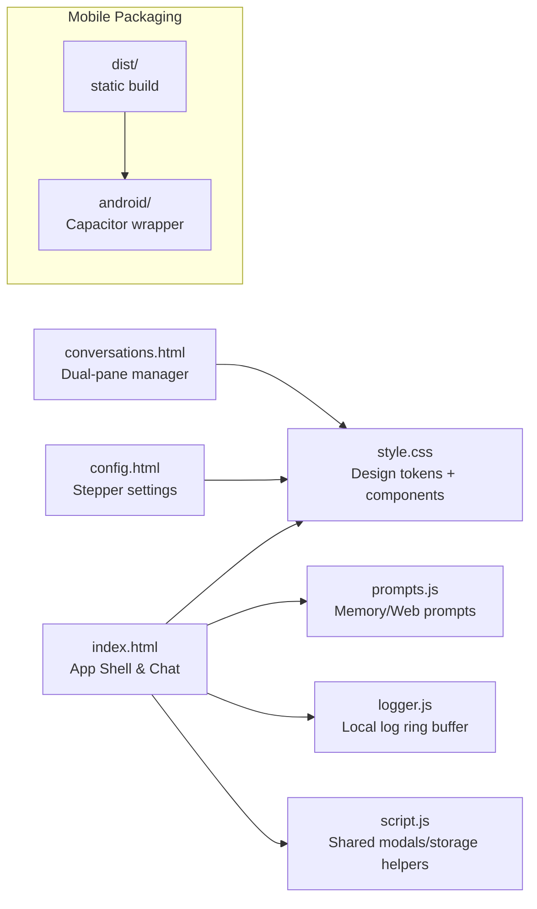

# FreeChat

## Project Overview
FreeChat is a privacy-first chat surface built purely with static HTML/CSS/JavaScript. The refreshed interface ships a unified app shell (desktop dual-column + mobile drawer), inline toast/status feedback, multi-select conversation management, and a guided stepper-based settings center. All data—messages, groups, memories, logs, configuration—stays on the device (`localStorage`/IndexedDB), and the exact assets can be wrapped into an Android app through Capacitor.

### Highlights
- **On-device privacy** – no login or sync; a privacy banner and stats panel remind users that every bit stays local.
- **Unified UX** – the chat page now combines an app bar, adaptive drawer, token meter, and contextual toasts; the conversation manager renders card-based sections with batch actions; the config center introduces a four-step flow with live summaries.
- **Mobile polish** – sticky composer, swipe-friendly tool rows, full-screen drawer sheets, and sticky batch bars keep the phone UI tidy and thumb-friendly.
- **Memory pipeline** – session/group memories are generated asynchronously via worker jobs and injected ahead of prompts (web synthesis → group → session → history). Reasoning output and citations remain foldable.
- **Android-ready** – `npm run build` + `npx cap copy` reproduces the same UI inside a WebView without bundlers.

## Project Structure Overview

## Project Usage Overview
1. **Quick start**
   - Clone the repo and open `index.html` directly in a modern browser (no build required).
   - Optional: `npm install && npm run build` to copy assets into `dist/` for packaging/deployment.
2. **Chat workspace**
   - Desktop keeps the conversation drawer in view; mobile toggles it via the history button.
   - Composer auto-grows, exposes placebo voice/attachment slots, and shows a token meter; `Enter`/`Ctrl+Enter` sends while `Shift+Enter` inserts a newline.
   - Thinking/Web toggles live next to the composer; a status pill plus toast stack report streaming or warnings.
3. **Conversation manager (`conversations.html`)**
   - Left sidebar lists groups with rename/delete/regenerate buttons; the right column renders cards grouped by folder.
   - Enable “multi-select” to batch move/delete/export conversations; selected items highlight and update the counter/CTA state.
4. **Settings center (`config.html`)**
   - Stepper: pick a model → tune parameters → configure web search → manage system prompt & privacy notes.
   - A live summary card mirrors saved values (model/params/web/system); a privacy panel reports local storage stats.
5. **Android packaging**
   - `npm run build` → `npx cap copy` → open `android/` in Android Studio to run or build APK/AAB.

## Dependencies Overview
- **Runtime (CDN-loaded):** `marked` (Markdown), `DOMPurify` (sanitizer), `CryptoJS` (demo key decrypt), `Font Awesome`, Google Fonts (`Inter`).
- **Tooling:** Node.js/npm (for `npm run build`), Capacitor CLI, JDK 17 + Android SDK for packaging scripts.
- No bundler/dev server is required for local/web use; everything remains static assets.

## Implementation Notes
- **LocalStorage keys:** `deepseekConversation`, `savedDeepseekConversations`, `conversationGroups`, `memoryJobs`, `freechat.logs`, `freechat.web.*`, `freechat.systemPrompt`, `freechat.modelParams`, etc.
- **Memory & injection:** worker-processed jobs keep the UI responsive. Providers limited to one system prompt receive merged content separated by `---`.
- **Web Search plugin:** toggled inline, configured in `config.html`; citations render under each assistant message.
- **Logging:** `Logger.export({ scope: 'current' | 'all', format: 'ndjson' })` outputs masked request/response traces.

## Security Notes
- The AES-obfuscated OpenRouter key is for demos only; replace it or, preferably, route traffic through your own backend proxy before shipping.
- Client-side calls remain subject to CORS—deploy behind a gateway for production workloads.

## License
MIT

