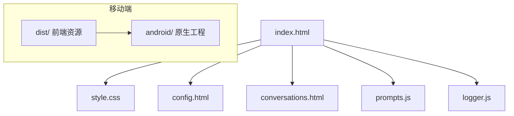

# FreeChat

FreeChat 是一个轻量级的本地 Web 聊天应用，适用于快速原型与演示。项目为纯静态前端实现（HTML/CSS/JS），支持配置外部聊天 API、会话持久化、会话/分组记忆以及可选的 Android（Capacitor）打包。

注意事项：
- 仓库包含一个用于演示的内置加密 OpenRouter Key；切勿在生产环境使用。若要使用自有 Key，请替换 `index.html` 中的加密串或采用后端代理。
- 默认演示端点：`https://openrouter.ai/api/v1/chat/completions`
- 默认演示模型：`minimax/minimax-m2:free`

功能
- 通过可配置的外部 API 发送/接收消息。
- 自动将会话以节流方式持久化到 localStorage（`savedDeepseekConversations`）；首条发送自动创建会话条目。
- 会话分组：支持创建/重命名/移动/删除分组。
- 会话/分组记忆：自动生成摘要并在请求前注入为 system 消息（支持多条注入与对单 system 提供商的合并）。
- 联网检索（OpenRouter web plugin）支持：可配置引擎/结果数/上下文强度/搜索提示，返回引用会在助理消息下方渲染为折叠的引用列表。
- 流式与思考展示：支持流式输出；若返回 reasoning，则在助理回复上方展示并可折叠。
- 本地请求/响应日志（遮蔽 Authorization）。
- 支持使用 Capacitor 将 `dist/` 打包到 Android 工程。

快速开始
1. 克隆或下载仓库。
2. 在浏览器中打开 `index.html`（开发无需构建）。
3. 若要为 Capacitor 构建：`npm install`，然后 `npm run build`（复制静态资源到 `dist/`）。
4. 同步并运行：`npx cap copy` → 在 Android Studio 打开 `android/` 并运行或打包。

配置说明
- `config.html` 保存：
  - `localStorage.chatModel`：全局模型名。
  - `freechat.systemPrompt`：可选全局 system 提示，存在时作为首条 system 注入。
  - `freechat.modelParams`：模型参数 JSON（temperature/top_p/max_tokens/stream）。
  - `freechat.web.*`：联网搜索参数（engine/maxResults/contextSize/searchPrompt）。
- 单个会话会保存其 `model` 与 `modelParams`，以便回放时使用原始参数。
- 运行时模型解析使用 `getCurrentModel()`：会话级 `model` → `localStorage.chatModel` → 兜底默认。

记忆与注入
- 记忆生成为异步后台任务：摘要任务入队 `memoryJobs` 并由 Blob Worker 处理，完成后写回并更新分组记忆聚合，UI 在会话头部显示记忆状态徽章。
- 注入顺序：Web 合成提示（若启用）→ 分组记忆（逐条）→ 当前分组会话记忆（逐条）→ 历史消息；对单 system 提供商合并为一条（用 `---` 分隔段落）。
- 提示词模板与规则位于 `prompts.js`，包含噪音过滤与长度限制。

Web Search（OpenRouter web plugin）
- 输入区左侧有内联开关启用/禁用 Web Search，参数在 `config.html` 配置并保存到 `freechat.web.*`。
- 请求体包含 `plugins: [{ id: "web", ... }]`，返回中若包含 `message.annotations[].url_citation`，页面会将其显示为折叠的“参考来源 (N)”列表。
- 启用时注入 `PROMPTS.WEB_SYNTHESIS`，要求“先给结论再给引用”，并规定时间格式（Asia/Shanghai）与引用/正文的一一对应。

重要 localStorage 键
- `deepseekConversation`、`savedDeepseekConversations`、`conversationGroups`、`memoryJobs`、`deepseekApiKey`（回退）、`freechat.logs`、`freechat.web.*`、`freechat.memory.*`、`freechat.systemPrompt`、`freechat.modelParams`。

日志与导出
- `logger.js` 将事件写入 `freechat.logs`（环形缓冲，默认 1000 条）。导出示例（在浏览器控制台执行）：
```js
Logger.export({ format: 'ndjson', scope: 'current' });
Logger.export({ format: 'ndjson', scope: 'all' });
Logger.export({ format: 'json', scope: 'byConversationId', conversationId: 'YOUR_ID' });
```

Android（Capacitor）
- 构建并复制静态资源：`npm run build` → `npx cap copy` → 在 Android Studio 打开 `android/` 并运行/打包。
- Windows 一键：`scripts/build-apk.ps1` / `scripts/build-apk.cmd`（需安装 JDK17 与 Android SDK）。

安全建议
- 生产请勿在客户端保存 API Key；使用后端代理并在服务器端管理密钥。
- 客户端直接调用外部 API 可能受 CORS 限制；生产环境建议使用代理或后端中转。

项目结构（高层）


许可证
- MIT

注
- 有关实现细节（记忆队列、注入顺序、localStorage 键名等）请参阅 `index.html`、`prompts.js` 与 `logger.js`。

